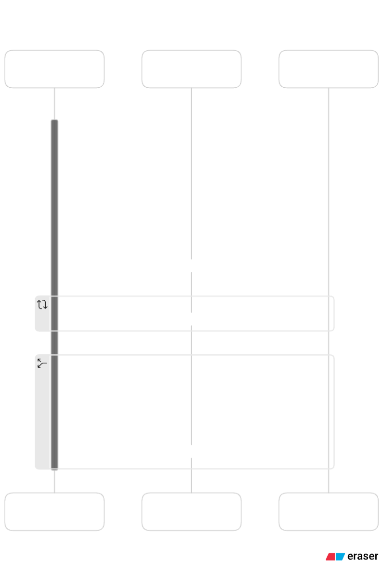

## Video Chat Application
This project is a real-time video chat application that utilizes Socket.IO for the initial discovery of peers and establishes a peer-to-peer (P2P) connection for the transfer of video and audio streams. The backend is built with Node.js and Socket.IO, which handles user management and initial signaling. Once the initial discovery is done, WebRTC, through the Simple-Peer library, facilitates a direct connection between clients to transfer media streams.

### Features
- User discovery via Socket.IO
- Real-time video and audio chat using WebRTC
- P2P direct media stream transfer
- Simple UI to display user list and manage calls

### How It Works
1. User Discovery: Upon launching the application, the client establishes a connection to the server via Socket.IO. The server maintains a list of connected users.

2. Initiating a Call: When a user initiates a call, the server uses Socket.IO to exchange signaling data between the calling and receiving clients.

3. Establishing P2P Connection: Once the initial signaling is complete, a direct P2P connection is established between the two clients using WebRTC, facilitated by the Simple-Peer library. This connection is used for transferring video and audio streams.

4. Call Management: Users can accept, reject, or end calls. The server updates the user list accordingly.

